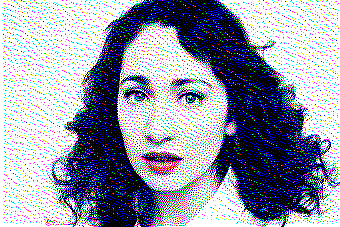
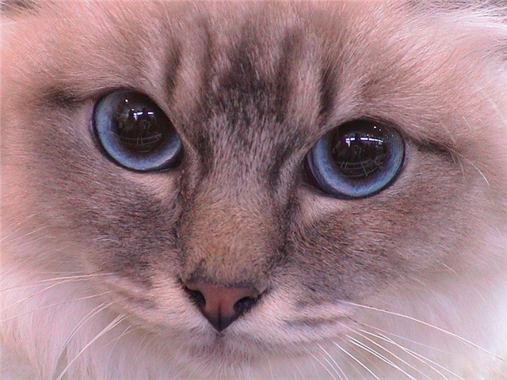

# Effect
Application for applying effects on pictures  
_Works only on **Linux**_

## Now implemented
### Effects
* Dithering
* Glitch
* Grayscale
* Invert

### Image Types
* BMP (24-bit)

## How to build
1. Clone repository
2. `mkdir build && cd build`
3. `cmake -DCMAKE_BUILD_TYPE=[Debug|Release|Sanitized] ..`
4. `cmake --build .`

## How to use
```
Usage: effect effect_name input_file_name [options]
Allowed options:
  --help                produce help message
  -e [ --effect ] arg   effect name
  -i [ --input ] arg    set input file name
  -o [ --output ] arg   set output file name
```

## Examples
### Dithering





### Grayscale



### Invertion


## How to implement new effect
You need to inherit from the base class `Effect` and implement its
methods `apply` and `name`. You also need to implement in the same
file a simple function to create objects of this class - `create_effect`.
After that, you need to create **shared** library from this file and put
it in the _src/effects/_ folder.

### Implementation
```cpp
class YourEffect : public Effect {
public:
  void apply(int width, int height, std::vector<std::vector<Pixel>> &data) override {
    // Pixel manipulation
  }

  std::string name() override {
    return "your_effect_name";
  }
};

extern "C" {
  Effect *create_effect();
}
```

To implement new **image type**, you will need to do the same but with base
class `ImageType`, function `create_image_type` and folder _src/filetypes/_
.