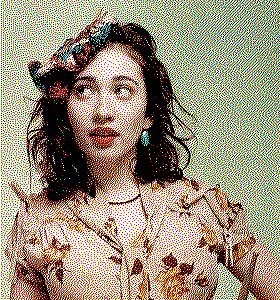
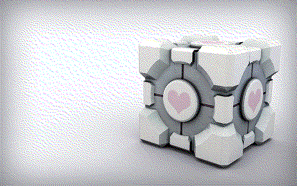
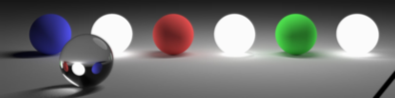
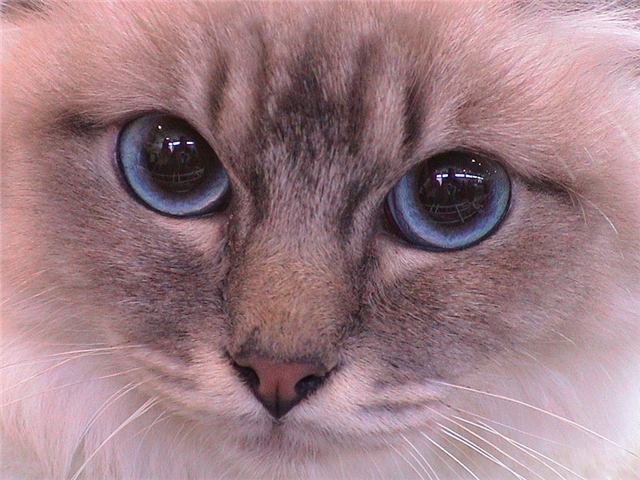
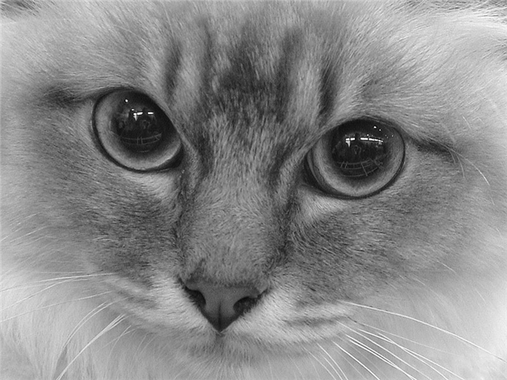

# Effect
Application for applying effects on pictures  
_Works only on **Linux**_

## Now implemented
### Effects
* Dithering
* Glitch
* Grayscale
* Invert
* Gaussian blur

### Image Types
* BMP (24-bit)

## How to build
1. Clone repository
2. `mkdir build && cd build`
3. `cmake -DCMAKE_BUILD_TYPE=[Debug|Release|Sanitized] ..`
4. `cmake --build .`

## How to use
```
Usage: effect effect_name input_file_name [options]
Allowed options:
  --help                produce help message
  -e [ --effect ] arg   effect name
  -i [ --input ] arg    set input file name
  -o [ --output ] arg   set output file name
```

To see **effect-specific options** type
```
effect effect_name --help
```
Example for Gaussian blur effect
```
Options for effect:
  --sigma arg (=1.25)   Blur degree (preferably 0.7 to 10)
```
To set them, you need to use the **equals operator**
```
effect blur image.bmp --sigma=5
```


## Examples
### Dithering
Original image                     | Factor = 1                            | 
-----------------------------------|----------------------------------------|
|  | 

Original image                     | Factor = 1                            |
-----------------------------------|----------------------------------------|
|  |

Original image                     | Factor = 2                            |
-----------------------------------|----------------------------------------|
|  |

### Gaussian blur
Original image                     |                  |
-----------------------------------|---------------------------|
**Sigma = 1.25** | |
**Sigma = 3**   ||
**Sigma = 10**   |!|


### Grayscale
Original image                     | Proceeded                            | 
-----------------------------------|----------------------------------------|
|  |

### Invertion
Original image                     | Proceeded                            | 
-----------------------------------|----------------------------------------|
|  |

## How to implement new effect
You need to inherit from the base class `Effect` and implement its
methods `apply`, `readParameters` and `name`. You also need to implement in the same
file a simple function to create objects of this class - `create_effect`.
After that, you need to create **shared** library from this file and put
it in the _src/effects/_ folder.

### Implementation
```cpp
class YourEffect : public Effect {
public:
  // Applying effect on image data
  void apply(int width, int height, std::vector<std::vector<Pixel>> &data) override;

  // Read parameters from command line using boost::program_options library
  void readParameters(boost::program_options::options_description &desc, int argc, char **argv) override;

  // Name of your effect
  std::string name() override;
};

extern "C" {
  Effect *create_effect();
}
```

To implement new **image type**, you will need to do the same but with base
class `ImageType`, function `create_image_type` and folder _src/filetypes/_
.